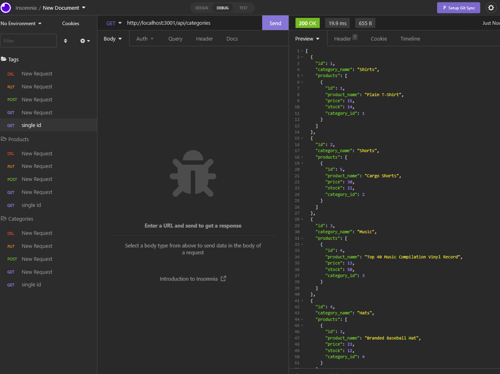

# E-Commerce-BackEnd-W13

## Description

Internet retail, also known as **e-commerce**, is the largest sector of the electronics industry, generating an estimated $29 trillion in 2019. E-commerce platforms like Shopify and WooCommerce provide a suite of services to businesses of all sizes. Due to their prevalence, understanding the fundamental architecture of these platforms will benefit users as a full-stack web developer.


## Table of Contents
- [User-Story](#user-story)
- [Usage](#usage)
- [Installation](#Installation)
- [Screenshots-of-Deployment](#screenshots-of-Deployment)
- [Walkthrough-Video-Link](#walkthrough-Video-Link)
- [URL-of-GitHub-Repository](#URL-of-GitHub-Repository)


## User-Story

```md
AS A manager at an internet retail company
I WANT a back end for my e-commerce website that uses the latest technologies
SO THAT my company can compete with other e-commerce companies
```

## Usage

```md
GIVEN a functional Express.js API
WHEN I add my database name, MySQL username, and MySQL password to an environment variable file
THEN I am able to connect to a database using Sequelize
WHEN I enter schema and seed commands
THEN a development database is created and is seeded with test data
WHEN I enter the command to invoke the application
THEN my server is started and the Sequelize models are synced to the MySQL database
WHEN I open API GET routes in Insomnia for categories, products, or tags
THEN the data for each of these routes is displayed in a formatted JSON
WHEN I test API POST, PUT, and DELETE routes in Insomnia
THEN I am able to successfully create, update, and delete data in my database
```

## Installation
- mysql
- node.js
- Insomnia

## Screenshots-of-Deployment
### View from Insomnia
;


## Walkthrough-Video-Link
### VS Code Development
https://youtu.be/aBhEwCG3x8M

### Insomnia Development
https://youtu.be/9mfndUPzWAM


## URL-of-GitHub-Repository
https://github.com/mattesanna017/E-Commerce-BackEnd-W13